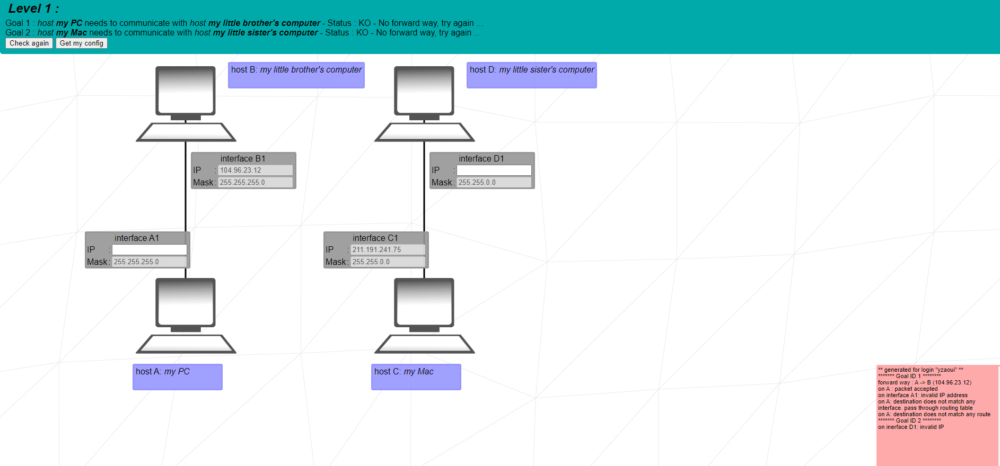
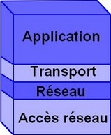
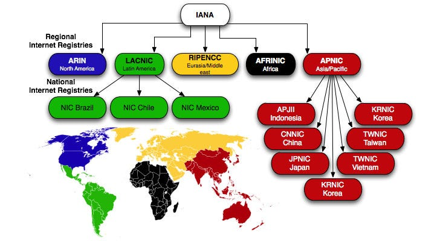

# Net_Practice

## C'est quoi ?

Net_Practice et un projet de 42. Il a pour but de nous faire decouvire ce qu'est le résaux et les adresse IP. Plus savoir qu'es que Net_Practice et un projet de 42. Il a pour but de nous faire decouvire ce qu'est le résaux et les adresse IP. Plus savoir qu'es que le protocole TCP/IP

### Ques que je dois faire ?

Je dispose d'un [dossier](./exo/) il contient des fichiers html avec css et js.
les fichier html sont des résaux fictifs et ma missions et de configurer leur adressage d'ip.



## Question

Ce sont des question utile pour comprendre ce que je fais

### C'est quoi un protocole ?

[Un protocole informatique](https://fr.wikipedia.org/wiki/Protocole_informatique) (ou parfois tout simplement un protocole quand le contexte de l'informatique est clair) est un ensemble de règles qui régissent les échanges de données ou le comportement collectif de processus ou d'ordinateurs en réseaux ou d'objets connectés. Un protocole a pour but de réaliser une ou plusieurs tâches concourant à un fonctionnement harmonieux d'une entité générale.

en gros c'est comment vont communiquer 2 appareil electronique pour des echange de donnée ou juste de la communication

#### Exemple

Les protocoles les plus nombreux sont les protocoles de communication, parmi lesquels il y a:
- les protocoles de réseau, ainsi les plus célèbres sont Tcp/ip qui régit Internet
- Hypertext Transfer Protocol (HTTP) qui régit le Web.

### TCP et IP c'est quoi ?


```
TCP = Transmission Control Protocol, Protocol de contrôle des transmissions.

IP = Internet Protocol, Protocole Internet.

TCP/IP est un ensemble de règles normalisées permettant aux ordinateurs de communiquer sur un réseau tel qu'Internet.
```

c'est des protcoles qui a pour but de communiquer dans un resaux.

TCP et IP sont deux protocoles de réseau informatique distincts.

IP est le protocole de comment on fais les adresse. 
TCP est le protocole d comment les machine communique.

annalogie : IP -> fonctionement des adresse de maison | TCP -> fonctionement des facteur.

donc TCP ne peux pas marcher si il ne connais pas les bonne adresse de machine donc les deux protocole sont lier.


doc : https://www.avast.com/fr-fr/c-what-is-tcp-ip

#### comment sa marche ??

En gros au lieux denvoyer un gros message d'un coup ce qui se passe ce que le message sera divise par paquet et passera par 4 couche puis sera reconstituer chez le recepteur et passera par les 4 couche de maniere inverse c'est le model TCP/IP je vais essaye dexpliquer chaqu'une des couches.



1. Couche Application :

c'est le lien entre lutilisateur et une interface.
puis soccupera de diviger le gros message en plussieur partie comme une compilation.
et ouvrira une session avec une autre machine.

2. Transport :

cherche le meillieur moyen pour transmettre les paquets.

3. Réseau :

contrôle le mouvement des paquets sur le réseau.

4. Accès réseau :

La couche de liaison de données, également appelée couche d'interface réseau ou couche physique, gère les parties physiques de l'envoi et de la réception de données à l'aide du câble Ethernet, du réseau sans fil, de la carte d'interface réseau, du pilote de périphérique de l'ordinateur, etc.

### C'est quoi c'est chiffre d'adresse d'IP ??

en gros pour protcole IP chaque machine dois posseder une adresse propre et pour ce faire elle est compose de 4 octet / 32 bit.
qui a un sous / masque qui definie le nombre de machine dans le esaux possible.

exemple : 186.12.11.200/25

les puissance de 2.
|--------|-----|
| 2 ** 0 | 1   |
| 2 ** 1 | 2   |
| 2 ** 2 | 4   |
| 2 ** 3 | 8   |
| 2 ** 4 | 16  |
| 2 ** 5 | 32  |
| 2 ** 6 | 64  |
| 2 ** 7 | 128 |


| binaire       | decimal |
|---------------|---------|
|1 1 1 1 1 1 1 1| 255     |
|1 1 1 1 1 1 1 0| 254     |
|1 1 1 1 1 1 0 0| 252     |
|1 1 1 1 1 0 0 0| 248     |
|1 1 1 1 0 0 0 0| 240     |
|1 1 1 0 0 0 0 0| 224     |
|1 1 0 0 0 0 0 0| 192     |
|1 0 0 0 0 0 0 0| 128     |
|0 0 0 0 0 0 0 0| 0       |
|0 0 0 0 0 0 0 1| 1       |
|0 0 0 0 0 0 1 1| 3       |
|0 0 0 0 0 1 1 1| 7       |
|0 0 0 0 1 1 1 1| 15      |
|0 0 0 1 1 1 1 1| 31      |
|0 0 1 1 1 1 1 1| 63      |
|0 1 1 1 1 1 1 1| 127     |

exemple de masque :

| masque | binaire                             | decimal         | plage disponible |
|--------|-------------------------------------|-----------------|------------------|
| /32    | 11111111.11111111.11111111.11111111 | 255.255.255.255 | 0                |
| /31    | 11111111.11111111.11111111.11111110 | 255.255.255.254 | 1                |
| /30    | 11111111.11111111.11111111.11111100 | 255.255.255.252 | 3                |
| /29    | 11111111.11111111.11111111.11111000 | 255.255.255.248 | 7                |
| /28    | 11111111.11111111.11111111.11110000 | 255.255.255.240 | 15               |
| /27    | 11111111.11111111.11111111.11100000 | 255.255.255.224 | 31               |
| /26    | 11111111.11111111.11111111.11000000 | 255.255.255.192 | 63               |
| /25    | 11111111.11111111.11111111.10000000 | 255.255.255.128 | 127              |
| /24    | 11111111.11111111.11111111.00000000 | 255.255.255.0   | 255              |
| /23    | 11111111.11111111.11111110.00000000 | 255.255.254.0   | 556              |
| /22    | 11111111.11111111.11111100.00000000 | 255.255.252.0   | 258              |
| /21    | 11111111.11111111.11111000.00000000 | 255.255.248.0   | 262              |
| /20    | 11111111.11111111.11110000.00000000 | 255.255.240.0   | 270              |
| /19    | 11111111.11111111.11100000.00000000 | 255.255.224.0   | 286              |
| /18    | 11111111.11111111.11000000.00000000 | 255.255.192.0   | 318              |
| /17    | 11111111.11111111.10000000.00000000 | 255.255.128.0   | 382              |
| /16    | 11111111.11111111.00000000.00000000 | 255.255.0.0     | 500              |


pour les resaux privée on nous consseil d'utiliser ces plage :

| Préfixe        | Plage IP                      | Nombre d'adresses      |
|----------------|-------------------------------|------------------------|
| 10.0.0.0/8     | 10.0.0.0 – 10.255.255.255     | 2**(32-8)  = 16 777 216|
| 172.16.0.0/12  | 172.16.0.0 – 172.31.255.255   | 2**(32-12) = 1 048 576 |
| 192.168.0.0/16 | 192.168.0.0 – 192.168.255.255 | 2**(32-16) = 65 536    |

Et pour les adresse publique c'est les fournisseur d'acces a internet qui les attribut.
et c'est l'ICAN qui sen occupe d'un point du vu mondial il soccupe la gestion des espace d'adressage d'ip.

en gros un LIR (Local Internet Register) demande aux RIPENCC une ip punlique qui est gerer par l'ICAN.

un LIR son genrealement des FAI ou de multinationalle.


#### adresse particulières

| adresse IP     | particularitée                    |
|----------------|-----------------------------------|
| 0.0.0.0        | Hôte inconue, sur ce résaux       |
| 0.0.0.1        | l'hôte 1 de ce résaux             |
| 255.255.255.255| Tous les hôtes                    |
| 127.0.0.1      | Cet hôt (boucle local).           |
| 138.195.52.1   | l'hôte 52.1 du résaux 138.195.0.0 |
| 138.195.0.0    | Ct hôte sur le 138.195.0.0        |
| 193.104.1.255  | Tous les hôtes du 193.104.1.0     |


### un switch c'est quoi ??


C'est un boitier qui reunnis plusieur cable ethernet en 1 on peut y configurer des parfeux aussi.

### un routeur c'est quoi ??

un routeur permet de donner des routes à suivre aux resaux.


## Auteur

Ce projet a été réalisé par MOI !!! :smiley:

| Info          | Ou me retrouver                                                      |
| ------------- | -------------------------------------------------------------------- |
| Nom👋         | Zaoui                                                                |
| Prenom😄      | Yassine                                                              |
| Pseudo😁      | Yatsu                                                                |
| Login 42🏫    | Yzaoui                                                               |
| E-mail📬      | y.zaoui.pro@gmail.com                                                |
| Instagram📸   | [@yatsu__officiel](https://www.instagram.com/yatsu__officiel/)       |


